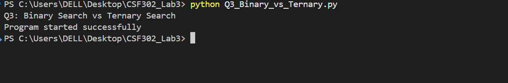
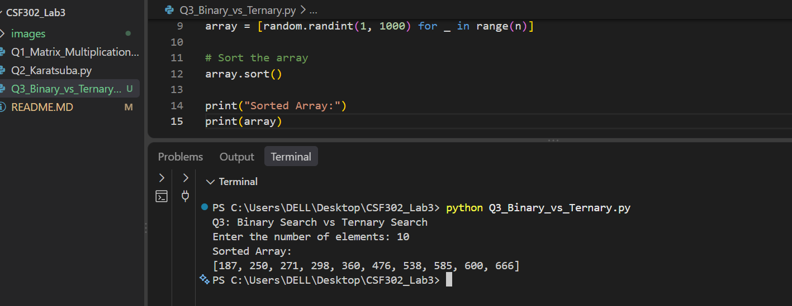
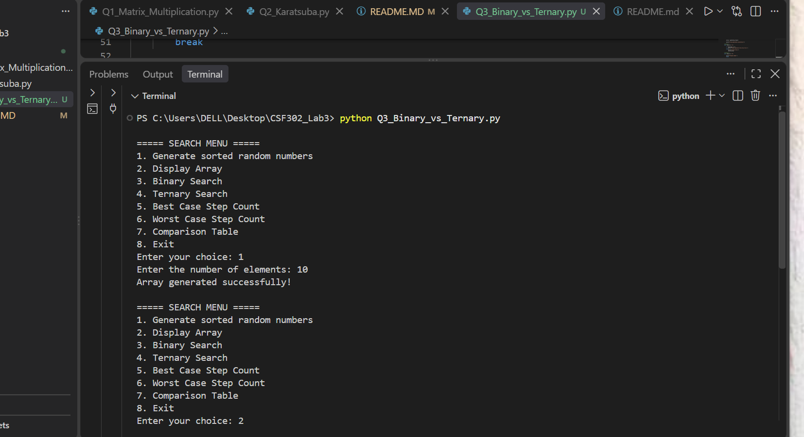
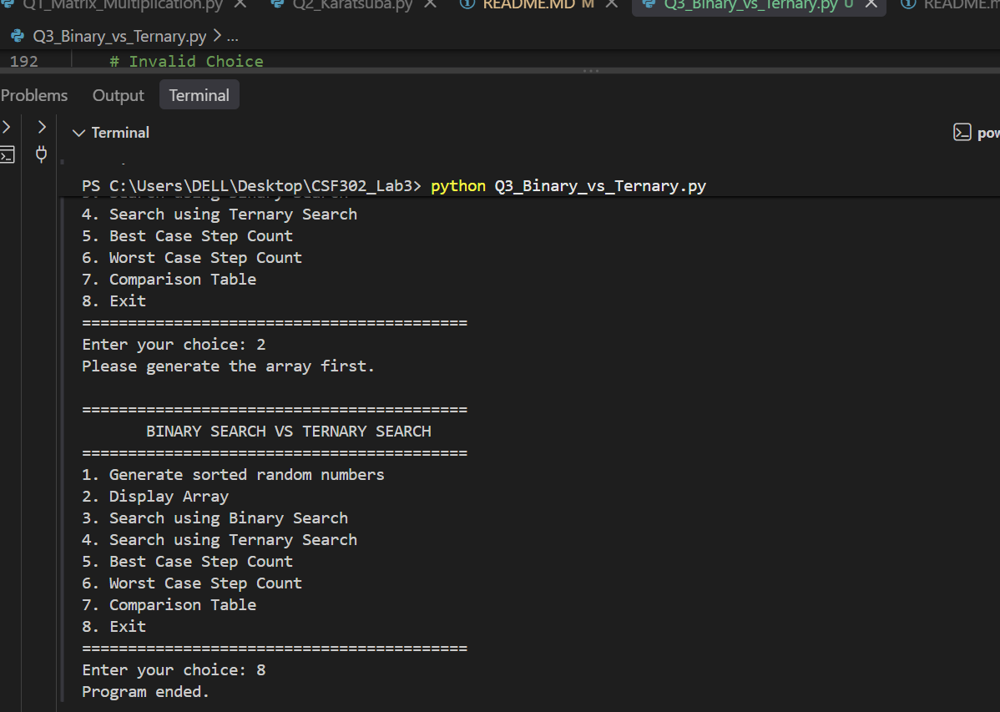
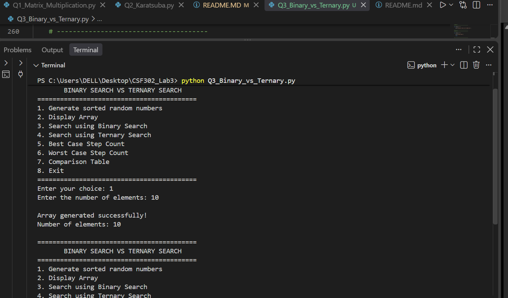
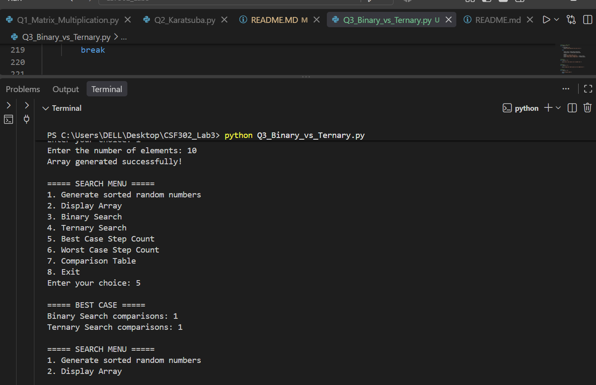
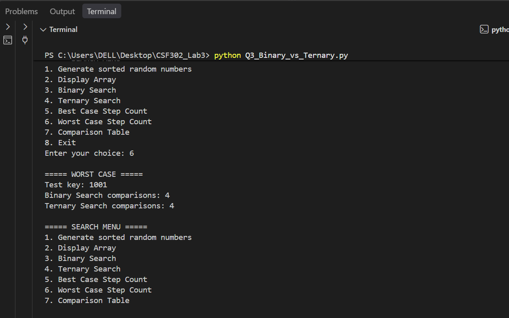
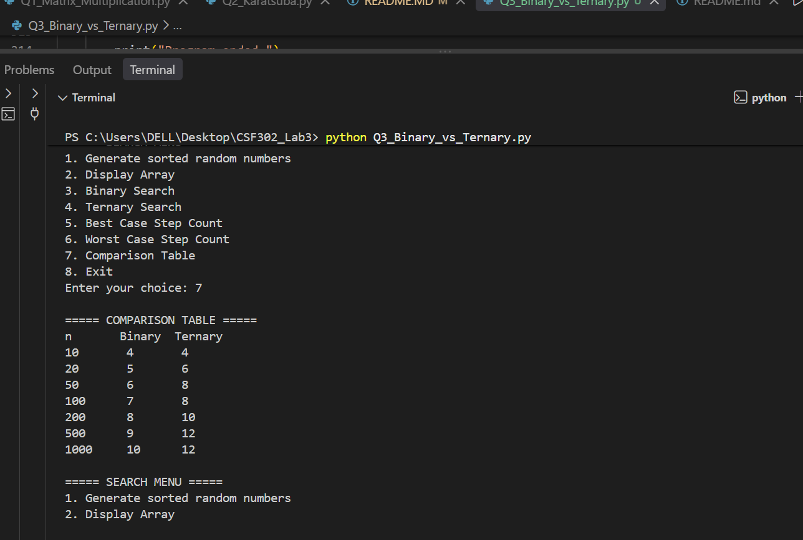

# Lab3-Report
## Question1 : Matrix Multiplication — Strassen's vs Traditional

1. Traditional Method (triple nested loop, O(n³))
- The traditional method multiplies two matrices using three nested loops. For each element of the result matrix, the corresponding row from the first matrix is multiplied with the corresponding column from the second matrix. The traditional matrix multiplication algorithm has a time complexity of: O(n³).

2. Strassen's Algorithm (divide and conquer, 7 multiplications per split)
- Strassen's algorithm uses the divide-and-conquer approach. Instead of directly performing all the multiplications required by traditional matrix multiplication, the matrices are divided into smaller submatrices. Strassen's algorithm uses 7 multiplications for each division instead of the 8 multiplications used in the basic divide-and-conquer method.

3. Test all matrix sizes and compare the running time.
- After calculating the matrix multiplication using both algorithms, the program compares the two results.

## Question2: Karatsuba's Algorithm for Large Integer Multiplication
1. Traditional Method (grade-school multiplication, O(n²))
- The traditional multiplication algorithm works like normal multiplication that we do manually. Each digit of the first number is multiplied by each digit of the second number.

2. Karatsuba's Algorithm (divide and conquer, 3 multiplications per split)
- Karatsuba needs addition and subtraction when combining the smaller results. Therefore, the program contains: add_strings () and subtract_strings () These functions perform addition and subtraction on numbers represented as strings. This means we do not need to convert the entire large number into a normal integer.

3. Test Different Numbers
- The program tests matrix multiplication using different matrix sizes: 2×2, 4×4, 8×8, 16×16, 32×32, 64×64, and 128×128. Both Traditional and Strassen's algorithms are executed for each size. The execution time is recorded and the results from both algorithms are compared to make sure they are the same.

4. Test 8 to 1024 Digits
- The program tests multiplication using numbers with 8, 16, 32, 64, 128, 256, 512, and 1024 digits. For each size, both Traditional multiplication and Karatsuba's algorithm are executed. Their execution times are recorded and their results are compared. If Results Match: True, it confirms that both algorithms produced the same correct result.

## Question3 : Binary Search vs Ternary Search (Menu-Driven Program)
1. Create a new file
- A new Python file was created for Q3. The file contains the program for comparing Binary Search and Ternary Search.

2. Generate n Sorted Random Numbers
- The program generates a specified number of random integers and sorts them in ascending order. This sorted array is used for searching.

3. Make It Menu-Driven
- A menu was created so that the user can select different operations, such as generating the array, displaying the array, performing searches, calculating step counts, and viewing the comparison table.

4. Binary Search
- Binary Search searches for a key by repeatedly dividing the sorted array into two parts. It checks the middle element and continues searching in the appropriate half until the key is found or the search range becomes empty.

5. Ternary Search.
- Ternary Search divides the sorted array into three parts. It checks two middle positions and then continues searching in the appropriate part of the array.

6. Best Case Step Count.
- The best case occurs when the required key is found during the first comparison. Therefore, both Binary Search and Ternary Search can have a minimum of one comparison in the best case.

7. Worst Case Step Count
- The worst case occurs when the key is not present in the array. The program searches until there are no more elements to check. The number of comparisons made during this process is recorded as the worst-case step count.

8. Comparison Table.
- The comparison table tests Binary Search and Ternary Search with different array sizes. The number of comparisons increases as the size of the array increases. The results help demonstrate how both searching algorithms perform as the input size becomes larger.

