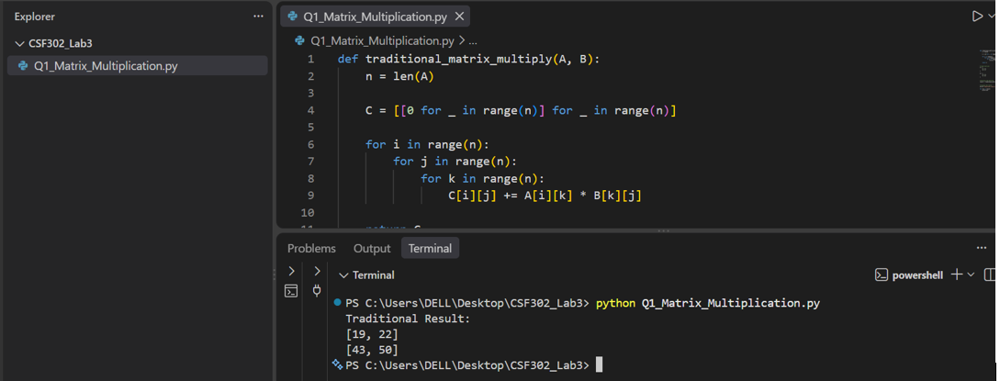
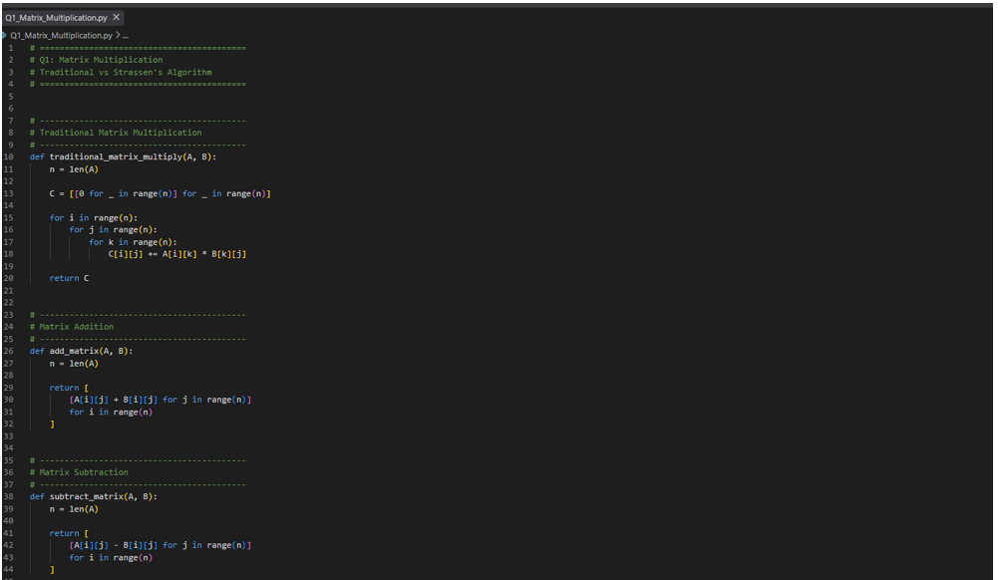
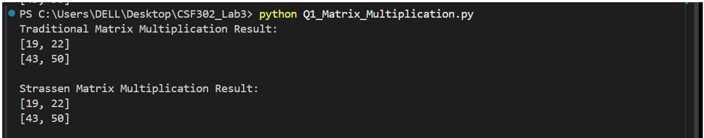
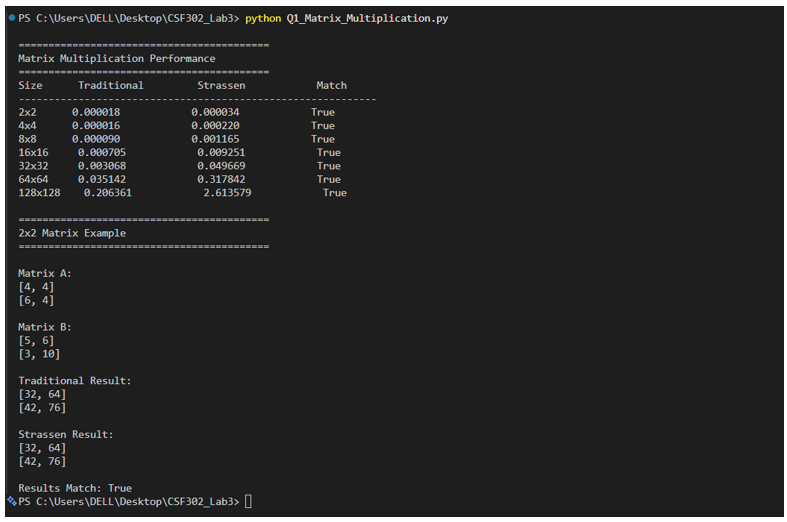
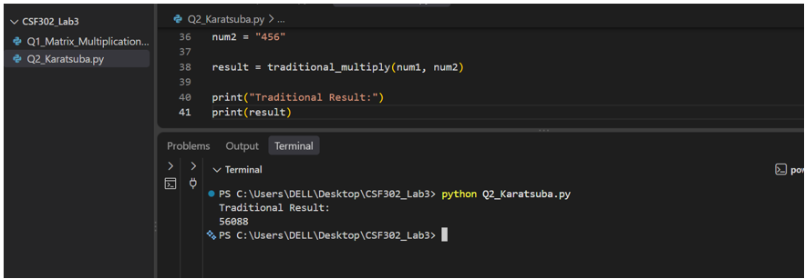
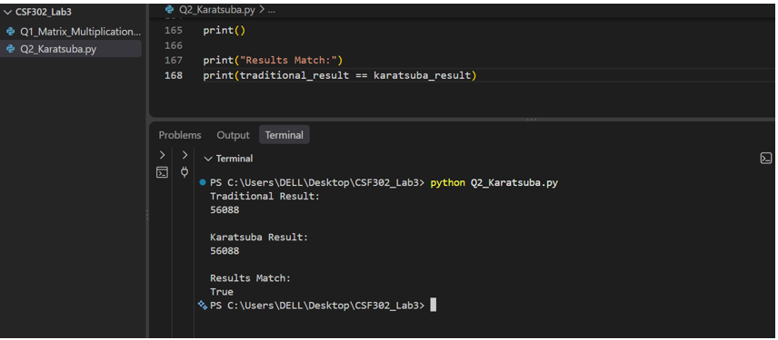
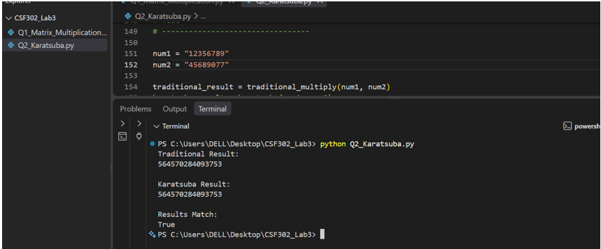
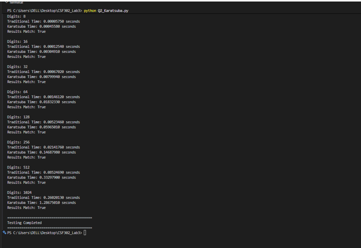

# Lab3-Report
## Question1 : Matrix Multiplication — Strassen's vs Traditional

1. Traditional Method (triple nested loop, O(n³))
- The traditional method multiplies two matrices using three nested loops. For each element of the result matrix, the corresponding row from the first matrix is multiplied with the corresponding column from the second matrix. The traditional matrix multiplication algorithm has a time complexity of: O(n³).

2. Strassen's Algorithm (divide and conquer, 7 multiplications per split)
- Strassen's algorithm uses the divide-and-conquer approach. Instead of directly performing all the multiplications required by traditional matrix multiplication, the matrices are divided into smaller submatrices. Strassen's algorithm uses 7 multiplications for each division instead of the 8 multiplications used in the basic divide-and-conquer method.

3. Test all matrix sizes and compare the running time.
- After calculating the matrix multiplication using both algorithms, the program compares the two results.

## Question2: Karatsuba's Algorithm for Large Integer Multiplication
1. Traditional Method (grade-school multiplication, O(n²))
- The traditional multiplication algorithm works like normal multiplication that we do manually. Each digit of the first number is multiplied by each digit of the second number.

2. Karatsuba's Algorithm (divide and conquer, 3 multiplications per split)
- Karatsuba needs addition and subtraction when combining the smaller results. Therefore, the program contains: add_strings () and subtract_strings () These functions perform addition and subtraction on numbers represented as strings. This means we do not need to convert the entire large number into a normal integer.

3. Test Different Numbers
- The program tests matrix multiplication using different matrix sizes: 2×2, 4×4, 8×8, 16×16, 32×32, 64×64, and 128×128. Both Traditional and Strassen's algorithms are executed for each size. The execution time is recorded and the results from both algorithms are compared to make sure they are the same.

4. Test 8 to 1024 Digits
- The program tests multiplication using numbers with 8, 16, 32, 64, 128, 256, 512, and 1024 digits. For each size, both Traditional multiplication and Karatsuba's algorithm are executed. Their execution times are recorded and their results are compared. If Results Match: True, it confirms that both algorithms produced the same correct result.

